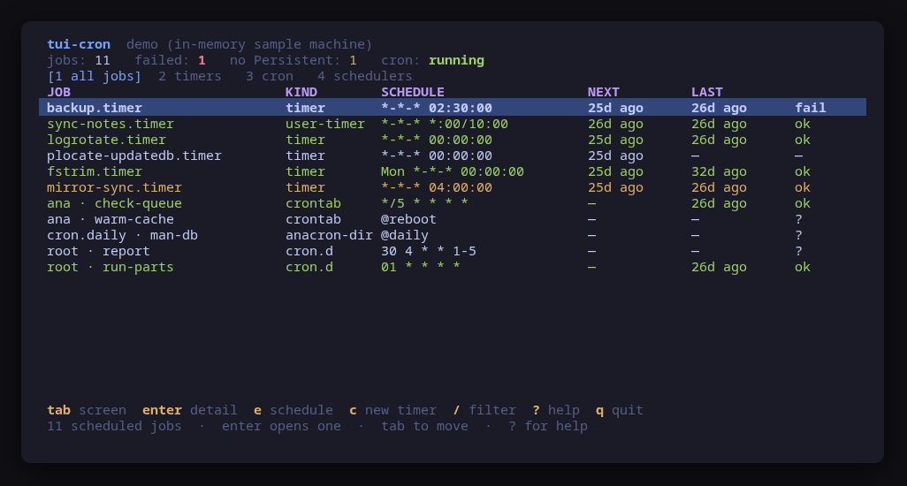
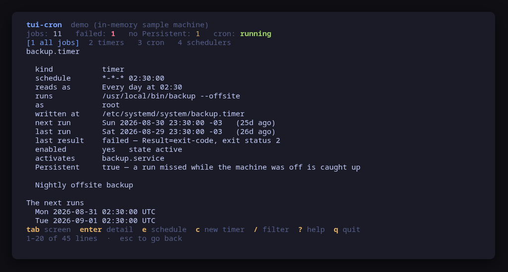
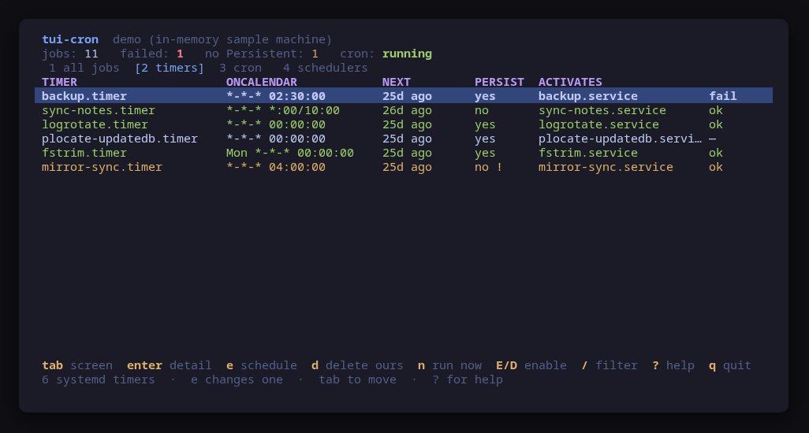
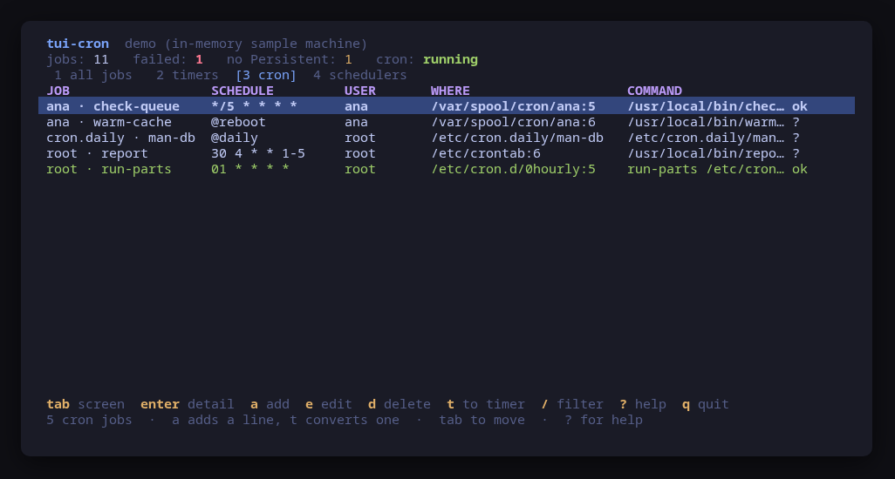
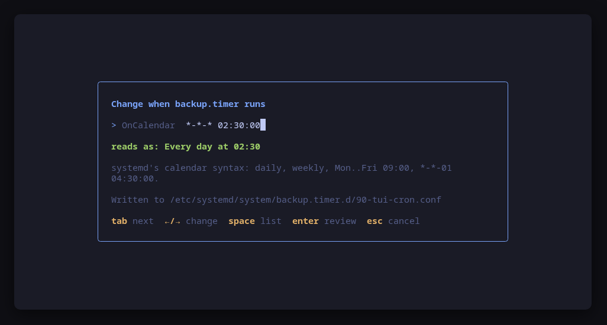
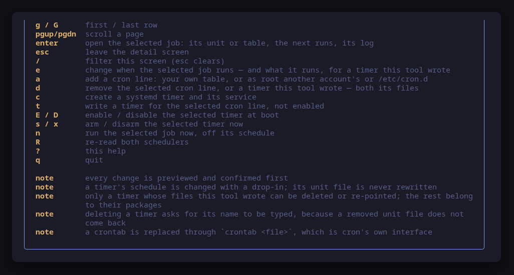

[](https://scorecard.dev/viewer/?uri=github.com/tui-tools/tui-cron)
[](https://www.bestpractices.dev/projects/14368)

> **Beta.** The family is days old and still changing. Package names, flags
> and keys may move without notice until 1.0. Pin versions, and report what
> breaks.

Every scheduled job on the machine, on one screen. **systemd timers and cron
together**, with the schedule written out in English next to the expression that
produced it, and the **exact command line of every change previewed before it
runs**.

A machine's scheduled work is split across two schedulers for historical reasons
and nobody's benefit. `systemctl list-timers` knows nothing about your crontab,
`crontab -l` knows nothing about anyone else's, `/etc/cron.d` is a directory
nobody remembers, and neither side will tell you what `17 3 * * 1` means.
`tui-cron` puts them on one list, in the [Omarchy](https://omarchy.org) visual
style.



> **Status: early, under validation.** An independent tool that follows the
> Omarchy visual style; it is **not** part of the Omarchy project and not
> endorsed by its maintainers. Expect rough edges.

## Install

<!-- install:start -->
<!-- Generated by tui-kit/tools/render-install.py from tool.json. -->
<!-- Edit the manifest, then run `make readme`. -->

### Arch Linux

Needs the tui-tools repository, which is a [one-time
setup](https://tui-tools.github.io/install/).

The one-liner detects the distribution and adds the repository and its signing
key:

```sh
curl -fsSL https://pkgs.tui.tools/install.sh | sh
```

Piping a script into a shell is not this family's style, so here is the same
setup by hand — read it, or read the script first with `curl -fsSL
https://pkgs.tui.tools/install.sh -o install.sh`:

```sh
curl -fsSL -o /tmp/tui-tools.asc https://pkgs.tui.tools/pubkey.asc
sudo pacman-key --add /tmp/tui-tools.asc
sudo pacman-key --lsign-key \
  "$(gpg --show-keys --with-colons /tmp/tui-tools.asc | awk -F: '/^fpr:/{print $10; exit}')"
printf '[tui-tools]\nServer = https://pkgs.tui.tools/arch/$arch\n' \
  | sudo tee -a /etc/pacman.conf
sudo pacman -Sy
```

Then, and for every other tool in the family:

```sh
sudo pacman -S tui-cron
```

Upgrades then arrive with the rest of your system updates.

### Debian and Ubuntu

Needs the tui-tools repository, which is a [one-time
setup](https://tui-tools.github.io/install/).

The one-liner detects the distribution and adds the repository and its signing
key:

```sh
curl -fsSL https://pkgs.tui.tools/install.sh | sh
```

Piping a script into a shell is not this family's style, so here is the same
setup by hand — read it, or read the script first with `curl -fsSL
https://pkgs.tui.tools/install.sh -o install.sh`:

```sh
sudo install -d -m 0755 /etc/apt/keyrings
curl -fsSL https://pkgs.tui.tools/pubkey.asc \
  | sudo gpg --dearmor -o /etc/apt/keyrings/tui-tools.gpg
echo "deb [signed-by=/etc/apt/keyrings/tui-tools.gpg] https://pkgs.tui.tools/deb stable main" \
  | sudo tee /etc/apt/sources.list.d/tui-tools.list
sudo apt update
```

Then, and for every other tool in the family:

```sh
sudo apt install tui-cron
```

Upgrades then arrive with the rest of your system updates.

### Fedora and RHEL

Needs the tui-tools repository, which is a [one-time
setup](https://tui-tools.github.io/install/).

The one-liner detects the distribution and adds the repository and its signing
key:

```sh
curl -fsSL https://pkgs.tui.tools/install.sh | sh
```

Piping a script into a shell is not this family's style, so here is the same
setup by hand — read it, or read the script first with `curl -fsSL
https://pkgs.tui.tools/install.sh -o install.sh`:

```sh
sudo rpm --import https://pkgs.tui.tools/pubkey.asc
sudo curl -fsSL -o /etc/yum.repos.d/tui-tools.repo https://pkgs.tui.tools/rpm/tui-tools.repo
sudo dnf makecache
```

Then, and for every other tool in the family:

```sh
sudo dnf install tui-cron
```

Upgrades then arrive with the rest of your system updates.

### Any distribution, static binary

```sh
curl -fsSL https://github.com/tui-tools/tui-cron/releases/download/v0.1.2/tui-cron_0.1.2_linux_amd64.tar.gz | tar -xz tui-cron
sudo install -m0755 tui-cron /usr/local/bin/tui-cron
```

One static binary. Verify it against checksums.txt from the same release.

### From source

```sh
git clone https://github.com/tui-tools/tui-cron
cd tui-cron && make build
sudo install -m0755 bin/tui-cron /usr/local/bin/tui-cron
```

Needs Go 1.27 or newer.

Not packaged for these yet; the static binary works everywhere in the meantime.

### Arch Linux (AUR) — coming soon

```sh
paru -S tui-cron-bin
```

The -bin package installs the released static binary.

### openSUSE — coming soon

Needs the tui-tools repository, which is a [one-time
setup](https://tui-tools.github.io/install/).

```sh
sudo zypper install tui-cron
```

The rpm repository is shared with dnf; zypper support is not tested yet.

### Verify a download

Every release of `tui-cron` ships a `checksums.txt`. Check an archive against
it before installing:

```sh
sha256sum -c checksums.txt --ignore-missing
```
<!-- install:end -->

One static binary, no daemon, no state of its own. Nothing keeps running after
you quit.

## Try it without root

```sh
tui-cron --demo
```

`--demo` runs against a sample machine: six timers — one that failed last night,
one that will silently skip a run the first morning the machine is off at four —
four cron lines including one `@reboot`, and a script in `/etc/cron.daily` that
nothing records anything about. Every key works, every command is built and
previewed for real, and nothing touches your system.

## What the schedule means

`17 3 * * 1` and `*-*-01..07 12:00:00` are both perfectly precise and neither is
readable. The mistakes people make with them are mistakes of *reading* — a job
meant to run once an hour that runs every minute of one hour, a "monthly" backup
that fires on the first of the month **and** every Monday — so the expression is
never rewritten for display. The English sits next to it, and you compare the
two.

```
*/5 * * * *        Every 5 minutes
01 * * * *         At 1 minute past every hour
30 4 * * 1-5       Monday to Friday at 04:30
Mon *-*-* 00:00:00 Every Monday at 00:00
*-*-01 04:30:00    On the 1st of every month at 04:30
Sat *-*-01..07 12:00:00
                   On the first Saturday of the month at 12:00
@reboot            At boot, once, and never again until the next one
```

Both grammars go through one parser. cron writes a range `1-5` and systemd
writes it `1..5`, and that separator is the only real difference between them at
that level — which is also why the conversion below can be exact.

One reading carries a warning of its own. A cron line that sets **both** a day
of the month and a weekday runs on **either**, not on both: `0 0 1 * 1` fires on
the 1st and on every Monday, and the reading says so in as many words. It is the
single most commonly misread thing in a crontab.

`systemd-analyze calendar` is asked too — for the next five runs on the detail
screen, and to validate an `OnCalendar` before you are asked to confirm
anything. Those numbers are systemd's, not this tool's.



## The timers



`2` is the systemd half: what each timer activates, when it runs next, and
whether a run missed while the machine was off is **caught up or skipped**.

That last column is the finding this tool exists to surface. Without
`Persistent=true`, systemd does not remember that a run was missed, so a laptop
asleep at 00:00 simply skips its daily job and nothing anywhere says so — which
is the failure mode people discover months later, through a backup that was
never taken. A timer that fires every few minutes does not care and is not
flagged; a daily one without it is.

The timers in **your own** manager are read too, through `systemctl --user`.
They are where a person's own scheduled work belongs and where nobody looks. On
a machine reached over a serial console there is no user bus at all, and the
tool says the user timers were not read rather than that there are none.

`e` changes the schedule, `E`/`D` enable and disable, `s`/`x` arm and disarm,
and `n` runs the job now — which starts the *service*, not the timer, because
arming a timer runs nothing.

The list is built from the timers systemd has **loaded** and from the timer
**unit files on disk**, merged. Both are needed: systemd loads no unit that
nothing references, so a timer written with `c` and not yet enabled is in
neither `systemctl list-timers` nor `systemctl list-units --type=timer`. It
would be on disk, correct, and invisible in the tool that wrote it — with no
row to select, and therefore no way to enable, run or remove it. Such a timer
shows up on the list straight away, with `not armed` in place of a next run
until `E` enables it.

### The timers this tool wrote are the only ones it will remove

A timer created with `c` or converted with `t` gets a header in both of its
files:

```ini
# Written by tui-cron on 2026-09-01 02:30:00 UTC.
```

That line is the whole ownership rule. `d` removes a timer only when **both**
its unit files are in `/etc/systemd/system` — the local administrator's
directory, never `/usr/lib` — **and both carry that header**. Anything else is
somebody's package, and it is refused with the reason: disabling it with `D` is
what stopping it means, and removing the file belongs to whatever installed it.
The answer is read off the files themselves rather than remembered in a state
file, so it survives a restored backup, a moved machine and a unit edited by
hand.

A deletion runs `systemctl disable --now`, `rm` on **both** files and on any
drop-in this tool left beside them, then `daemon-reload` — the unit unloaded
before the files it is read from go, because a timer left armed with no file
behind it is the one state nobody can explain afterwards. And because a removed
unit file does not come back, `d` on a timer asks for the unit's **name to be
typed** before it will even show the commands. A typo removes nothing.

`e` on a timer this tool wrote also offers what it runs. The `ExecStart` change
is a drop-in on the *service* — `/etc/systemd/system/<name>.service.d/90-tui-cron.conf`
— with the same empty-assignment trick the schedule uses, because `ExecStart` is
a list too and a drop-in that only names the new command would run both, one
after the other. The schedule and the command are two files, so they are changed
one at a time: the form says so rather than showing the diff of one and running
the commands of both.

## The cron jobs



`3` is the cron half, and it is four different things wearing one hat: your own
crontab, every other account's when this is run as root, `/etc/crontab` and
`/etc/cron.d` with their extra user field, and the scripts in
`/etc/cron.{hourly,daily,weekly,monthly}` whose schedule is the directory they
sit in.

**What cron records is less than you would like, and the screen says so.** cron
logs that a command started; cronie also logs that it returned; *neither records
an exit status anywhere*. A cron job that failed every night for a month looks
exactly like one that worked, unless the command itself said something —
whatever it printed went to the mail cron sends, not to the journal. So the last
result of a cron line is "it ran" at best, and the detail screen spells that out
rather than showing a green tick nobody should trust.

## Changing a timer, without rewriting its unit file

`tui-cron` never edits a unit file. It writes exactly one drop-in per timer,
`/etc/systemd/system/<timer>.timer.d/90-tui-cron.conf`, so a unit a distribution
shipped is left alone and the change is a file you can delete.

The drop-in is three lines rather than one, and the middle one is the point:

```ini
[Timer]
OnCalendar=
OnCalendar=*-*-* 03:15:00
```

systemd **adds** to a list-valued setting when a drop-in assigns it. A file
saying only `OnCalendar=*-*-* 03:15:00` would leave the old schedule in place
and the timer would fire on both — which is exactly the surprise this tool
exists to prevent. The empty assignment first is what clears it.

Before you are asked anything, the expression is handed to `systemd-analyze
calendar`: the same parser the timer will be armed with. The dialog then shows
what systemd normalized it to, the unified diff, and the four commands that
apply it — the drop-in directory, the install, `daemon-reload`, and a `restart`
of the timer, because a reload alone would leave it armed on the old schedule.



## Changing a crontab, through cron's own interface

A crontab is never edited as a file. `/var/spool/cron` is cron's own directory,
and writing into it behind cron's back skips the syntax check and, on Debian,
the ownership rules cron enforces — so `crontab <file>` is what runs, which is
what `crontab -e` runs too.

That means the whole table is replaced, and the diff shows it: every comment,
every blank line and every `MAILTO=` and `PATH=` above the jobs is carried
across untouched. Those lines are load-bearing, and a table regenerated from the
jobs alone would silently drop them.

`a` adds a line, `e` changes one, `d` removes one. A file in `/etc/cron.d` is
installed with `install -m 644` instead, and a name with a dot in it is refused
outright — cron ignores such a file, so a table saved as `backup.cron` is a
table that silently never runs.

### Where a new line goes, when you are root

Run as an ordinary user, `a` writes one place: your own crontab, through
`crontab <file>`. Run as root, it asks which of the three tables first:

| Target | What runs | What the line looks like |
| --- | --- | --- |
| your own crontab | `crontab <staged file>` | five fields and a command |
| another account's crontab | `crontab -u <who> <staged file>` | five fields and a command |
| `/etc/cron.d` | `install -m 644 <staged> /etc/cron.d/<name>` | five fields, **a user field**, and a command |

The fields follow the target: pick another account and the form asks whose,
pick `/etc/cron.d` and it asks for the file name and the user field that format
carries. The fields that do not apply are absent rather than ignored, and the
title names the table before you type a command into it.

The three are offered to root only because the other two are writes cron and the
filesystem refuse to everybody else — a picker that ended in a permission error
would be worse than no picker. Replacing another account's table still replaces
**the whole of it**, and the dialog says so above the diff.

### There is no portable way to have cron check a table

cronie ships `crontab -T`, which parses a file and reports. Debian's vixie cron
ships no equivalent, and no version flag either. A tool that used `-T` would
check its work on Fedora and silently skip the check on Ubuntu, which is worse
than not having one — so the check is in Go, in
[`internal/schedule`](internal/schedule/describe.go), and runs identically
everywhere: the schedule through the same parser that produces the English, the
user field where the format has one, and the command.

## Converting a cron line to a timer

`t` generates a `.timer` and `.service` pair from the selected cron line,
previews both, writes them to `/etc/systemd/system` — and **does not enable the
timer**, and does not touch the cron line. Two schedulers running the same job
is worse than one running it in the old place, so the conversion is a draft to
read, enable, and then remove the line behind. Doing any of that for you would
be doing the dangerous half first.

Two cron expressions have no `OnCalendar` at all, and both are refused with the
reason rather than approximated:

- **`@reboot`** is not a calendar. systemd spells it `OnBootSec=`, which needs a
  delay you choose rather than one this tool invents.
- **A day of the month *and* a weekday.** cron runs the job on either and
  systemd would run it only when both match. There is no single `OnCalendar`
  that means the same thing, and splitting one job into two silently is not
  something a converter should do.

A command that uses the shell is refused too. cron hands its command to
`/bin/sh`, so a pipe or a `>>` in a crontab works; systemd runs `ExecStart`
itself with no shell at all, and the same line would reach the program as
literal text. Wrapping it in `/bin/sh -c` would be a conversion that changes
what runs, so the dialog says to put the pipeline in a script and convert that.

## Usage

```sh
tui-cron                       # drive the real machine
tui-cron --demo                # sample machine, no privileges needed
tui-cron --check               # read both schedulers, print JSON, exit
tui-cron --report              # print what a bug report needs, exit
tui-cron --theme ~/mytheme/colors.toml
tui-cron --sudo ""             # run the commands directly (as root)
tui-cron --version
```

### `--check`, for scripts and tests

`--check` is the non-interactive read path: it loads both schedulers through the
same backend the UI would use, prints what it parsed as JSON and exits 0, or
exits 1 with the reason if neither can be read. No UI, and it never builds or
runs a mutation, so it is safe to run anywhere.

```console
$ tui-cron --check | head -20
{
  "tool": "tui-cron",
  "version": "0.1.0",
  "backend": "host",
  "describe": "systemctl via /usr/bin/sudo -n · crontab via /usr/bin/sudo -n",
  "jobs": 15,
  "counts": {
    "anacron-dir": 3,
    "cron.d": 1,
    "crontab": 0,
    "timer": 9,
    "user-timer": 2
  },
  "failed": [],
  "needPersistent": [
    {
      "name": "sysstat-collect.timer",
      "kind": "timer",
      "schedule": "*-*-* 00:00:00",
```

It exists so a test can assert on what the tool *parsed* rather than on what it
painted — that the timer count matches systemd's own lists, that cron is
reported present exactly when a `crontab` binary is there, and that the five
kinds sum to the total.

[tui-lab](https://github.com/tui-tools/tui-lab) uses it to test this tool
against real machines on Ubuntu, Fedora and Arch; the assertions live in
[`test/smoke.sh`](test/smoke.sh), and every one of them is read-only.

### `--report`, for bug reports

`--report` prints, in one block, everything a maintainer has to ask for
otherwise: the tool and kit versions, the version probed off systemd and
whether cron is here at all, the distribution, the kernel, the terminal, the
theme, the escalation prefix, and whether the running binary came from a
package. It needs no privileges and reads no schedule, so it is quick and it
works on the machine where the bug is — including one with neither scheduler,
which is itself a thing worth reporting.

```console
$ tui-cron --report
tui-cron 0.1.0 (kit v0.2.9)
backend: host (version unknown: systemd and cron are versioned separately)
mode: live
distro: fedora 42 (Fedora Linux 42 (Workstation Edition))
kernel: 6.19.14-108.fc42.x86_64
arch: x86_64
locale: en_US.UTF-8
term: xterm-256color
theme: tokyo-night
sudo: sudo -n
root: no
binary: /usr/bin/tui-cron (packaged)
schedulers: systemd 257, cron installed (no version command)
```

The block is written to be published as it is: it carries no hostname, user
name, home path or address, and no environment variable beyond `LANG`,
`LC_ALL`, `TERM` and `TERM_PROGRAM`. A binary living under your home directory
is reported as being there without naming the path. `--report` works with
`--demo` too, where it says so on the `mode` line.

The bug form asks for this block first — see
[`.github/ISSUE_TEMPLATE/bug_report.yml`](.github/ISSUE_TEMPLATE/bug_report.yml).

## What it can do to your machine

Every one of these is previewed and confirmed first.

| Key | What runs |
| --- | --- |
| `e` on a timer | `systemd-analyze calendar <expr>` (a read, before the question), then `install -d -m 755 /etc/systemd/system/<t>.timer.d`, `install -m 644 <staged> …/90-tui-cron.conf`, `systemctl daemon-reload`, `systemctl restart <t>.timer` |
| `e` on the command of a timer this tool wrote | `install -d -m 755 /etc/systemd/system/<n>.service.d`, `install -m 644 <staged> …/90-tui-cron.conf`, `systemctl daemon-reload` — the timer is not restarted, because the timer did not change |
| `d` on a timer this tool wrote | `systemctl disable --now <t>.timer`, `rm -f -- /etc/systemd/system/<t>.timer`, the same for `<n>.service` and for any drop-in this tool left, then `systemctl daemon-reload` |
| `e`/`a`/`d` on a cron line | `crontab <staged file>` for your own table, `crontab -u <who> <staged file>` for another account's, or `install -m 644 <staged> /etc/cron.d/<name>` for a system one |
| `c` / `t` | `install -m 644 <staged> /etc/systemd/system/<name>.service`, the same for `.timer`, then `systemctl daemon-reload` — and nothing else: the timer is **not** enabled |
| `E` / `D` | `systemctl enable` / `systemctl disable <t>.timer` |
| `s` / `x` | `systemctl start` / `systemctl stop <t>.timer` |
| `n` | `systemctl start <t>.service` |

Nothing else. A timer in your own manager gets `--user` in front of the verb,
read from the job rather than assumed. There is no code path that writes to
`/etc` other than those `install` commands, each with a destination this tool
checks rather than a parameter it trusts, and none of them can name a unit file
a distribution shipped. The `rm` commands are the same: the path is assembled
from a checked unit name and can only ever be a file directly inside
`/etc/systemd/system`, so there is no way to point one at `/usr/lib` or
anywhere else at all.

## Keys

| Key | Action |
| --- | --- |
| `tab` / `1`–`4` | Move between all jobs, timers, cron and the schedulers |
| `↑`/`k`, `↓`/`j` | Move the selection, or scroll the detail screen |
| `g` / `G` | First / last row |
| `pgup` / `pgdn` | Scroll a page |
| `enter` | Open the selected job: its unit or table, the next runs, its log |
| `esc` | Leave the detail screen |
| `/` | Filter this screen — including on the English (`esc` clears) |
| `e` | Change when the selected job runs — and what it runs, for a timer this tool wrote |
| `a` | Add a cron line: your own table, or as root another account's or `/etc/cron.d` |
| `d` | Remove the selected cron line, or a timer this tool wrote — both its files, after typing its name |
| `c` | Create a systemd timer and the service it runs |
| `t` | Write a timer for the selected cron line, not enabled |
| `E` / `D` | Enable / disable the selected timer at boot |
| `s` / `x` | Arm / disarm the selected timer now |
| `n` | Run the selected job now, off its schedule |
| `R` | Re-read both schedulers |
| `?` | Help |
| `q` | Quit |

In a **form**: `tab` moves between fields, `←`/`→` cycles a value, `space` opens
the list, `enter` builds the change and shows it, `esc` cancels. The reading
under the schedule field is recomputed on every keystroke, and so is the name of
the table an add form is about to write.



## What v0.1 can do

- List every scheduled job on the machine as one set: system timers, the timers
  in your own manager, your crontab and every other account's when run as root,
  `/etc/crontab`, `/etc/cron.d`, and the scripts in
  `/etc/cron.{hourly,daily,weekly,monthly}`.
- Read every cron and `OnCalendar` expression back in English, including cron's
  "day of month **or** weekday" trap, and filter on that English.
- Show when each job runs next and when it last ran, with the scheduler's own
  words for how that run ended — and say plainly, for a cron job, that cron
  records no exit status at all.
- Flag a timer that fires daily or less often without `Persistent=true`.
- Open one job in full: `systemctl cat` or the table it lives in, the next five
  runs as `systemd-analyze calendar` computes them, and its log.
- Change a timer's schedule through a drop-in, checked by `systemd-analyze
  calendar`, reviewed as a diff, applied with `daemon-reload` and a `restart`.
- Add, change and remove a cron line, in your own table or another account's,
  through `crontab <file>` — with the whole table diffed and its environment
  lines kept. As root, a new line can also go into `/etc/cron.d`, with the user
  field that format carries.
- Enable, disable, arm, disarm and trigger a timer, in either manager.
- Create a timer and its `Type=oneshot` service from a form, checked by
  `systemd-analyze verify` before you are asked.
- Convert a cron line to a timer, written but not enabled, refusing the two
  expressions and the one command shape that cannot convert exactly.
- Change what a timer this tool wrote runs, through a drop-in on its service.
- Delete a timer this tool wrote — both unit files, the drop-ins beside them and
  a `daemon-reload` — after the unit's name has been typed out.
- Follow the active Omarchy theme, and respect `NO_COLOR`.

## What v0.1 cannot do

- **No `OnBootSec` or `OnUnitActiveSec` editing.** A timer that fires relative
  to an event is listed and labelled, and the schedule editor refuses it: that
  is a change to the unit file, and this tool does not rewrite unit files.
- **No removing a unit somebody else wrote.** `d` removes the two files of a
  timer this tool wrote and nothing else. For anything a package installed,
  disabling it is what stopping it means and deleting the unit file belongs to
  whatever installed it.
- **No re-pointing a unit somebody else wrote.** Changing a packaged service's
  `ExecStart` is a change that package's next update would silently undo, so the
  field is not offered at all.
- **No editing a timer in your own manager beyond its schedule.** A user timer's
  files are in your own directory, not where this tool writes, so it is neither
  deleted nor re-pointed here.
- **No moving a script between `cron.daily` and `cron.weekly`.** The directory
  is the schedule, so the change is a `mv` and not a confirm dialog.
- **No anacron tuning.** `/etc/anacrontab`'s delays and `START_HOURS_RANGE` are
  read to explain what runs the `cron.*` directories, and not edited.
- **No mail configuration.** `MAILTO=` is preserved when a table is rewritten,
  never changed.
- **No `at`, no `batch`, no Kubernetes CronJobs.** This is the machine in front
  of you.
- The cron outcome column is as good as cron's own logging, which is not very:
  see above.

## Compatibility

<!-- compat:start -->
<!-- Generated by tui-kit/tools/render-compat.py from tool.json. -->
<!-- Edit the manifest, then run `make readme`. -->

`tui-cron` probes its backend once at startup and shows the version in the
header. A version nobody has tested is marked `(untested)` there rather than
hidden; one below the minimum is marked as such and the tool still runs.

### systemd

| | |
| --- | --- |
| Binary | `systemctl` |
| Version read with | `systemctl --version` |
| Minimum | 245 |
| Tested | `255`, `259`, `261` |
| Version-gated features | `timers-json` (since 250) |

| Versions | What changes |
| --- | --- |
| `<250` | `systemctl list-timers --output=json` does not exist, so the timers are enumerated from `systemctl list-units --type=timer` instead; nothing is lost, because every column shown is read from `systemctl show` either way |
| `>=245` | `systemd-analyze calendar --iterations` is what computes the next runs and validates a new OnCalendar. It arrived in 242, below this minimum, so it is not gated: on every version this tool supports it is simply there |
| `>=245` | a timer in your own manager is read through `systemctl --user`, which needs a user bus; over a serial console or a bare `sudo -i` shell there is none, and the tool says the user timers were not read rather than that there are none |

### cron

| | |
| --- | --- |
| Binary | `crontab` |
| Version read with | nothing: these tools report no version |
| Minimum | — |
| Tested | none yet |

| Versions | What changes |
| --- | --- |
| `>=1` | cron declares no version command. cronie answers `crontab -V` with "cronie 1.7.2"; Debian's vixie cron has no such flag and no sibling program that prints one, so a version would appear on Fedora and be blank on Ubuntu. The header shows cron without a number |
| `>=1` | there is no portable way to have cron check a table: cronie ships `crontab -T`, Debian's cron ships nothing equivalent. A line is therefore parsed by this tool before it is written, with the same check on every machine |
| `>=1` | cron records that a command started, and cronie also that it returned; neither records an exit status anywhere. A cron job's last result is therefore "it ran" at best, and the screen says so rather than implying it worked |
| `>=1` | a machine may have no cron at all — Omarchy Server is one — and that is a normal machine, not a failure: the timers are listed, and cron reports itself as absent with the reason |
| `>=1` | a machine with no cron may still carry run-parts scripts: Omarchy Server ships /etc/cron.hourly/snapper and nothing that walks the directory. They are listed anyway, and each row says nothing runs it rather than showing a file that looks scheduled as active |

The tested versions are generated from `compat/results.jsonl`, which the tool's
own smoke test appends to when it runs against a real machine in
[tui-lab](https://github.com/tui-tools/tui-lab).
<!-- compat:end -->

## Configuration

`/etc/tui-cron/config.toml`, then `~/.config/tui-cron/config.toml` (the user
file overrides the machine-wide one), then `TUI_CRON_*` in the environment.
Flags override everything. See [`examples/config.toml`](examples/config.toml).

```toml
# Privilege escalation prefix; "" runs the command directly.
sudo = "sudo -n"

# Path to an Omarchy-style colors.toml; empty follows the active theme.
theme = ""
```

## Theme

The default palette is **Tokyo Night**. On Omarchy, the tool reads the active
desktop theme from `~/.config/omarchy/current/theme/colors.toml` and follows it.
`TUI_THEME` or `--theme` override; `NO_COLOR` drops color and keeps layout. The
rules live in [tui-kit](https://github.com/tui-tools/tui-kit#theme-rules).

## Architecture

The UI never builds a `systemctl`, `crontab` or `journalctl` command line. It
talks to `internal/schedule.Backend`, which returns a scheduler-neutral model:

```
Model{Jobs, Timers, Cron, User}
Job{ID, Name, Kind, Schedule, Explain, Command, Owner, Unit, Service,
    File, Line, Next, Last, Outcome, Enabled, Persistent, Monotonic}
```

`Kind` is what keeps one type honest about two schedulers: `timer`,
`user-timer`, `crontab`, `cron.d`, `anacron-dir`. The actions a job accepts come
from the backend's `Capabilities`, so a machine with no cron and one with no
systemd both work and both say which they are.

Two packages start a process — `internal/timers` and `internal/crontab` — and
[`check-exec.sh`](https://github.com/tui-tools/tui-kit/blob/main/tools/check-exec.sh)
fails the build if any other package imports `os/exec`. `internal/jobs` joins
them into the one backend the UI sees and starts nothing itself:

```
systemctl        the timer list, the per-unit properties, and every control action
systemd-analyze  the calendar check and the next elapses
crontab          reading and replacing a table, the only supported way
journalctl       what each scheduler logged about a job
install / rm     the commands that put a file where it belongs
```

Mutations are `runner.Command` values produced by a backend. The UI shows them
and, on confirmation, hands the same ones back to the
[kit runner](https://github.com/tui-tools/tui-kit#the-contract-preview-confirm-run),
which resolves the binary and the privilege prefix. That is the whole trust
boundary, and it is why the preview is guaranteed to match what executes.

## Development

```sh
make check        # gofmt, go vet, the exec boundary and the tests: what CI runs
make test
make build
make demo
make screenshots  # re-render the frames above from --demo
```

The parser tests run against captured output in `internal/timers/testdata` and
`internal/crontab/testdata`. Nearly all of it is real: `systemctl list-timers`,
`systemctl list-units`, `systemctl show`, `systemctl cat`, `systemd-analyze
calendar`, `/etc/crontab`, `/etc/cron.d/0hourly`, the cron journal and
`crontab -V` all answer to any user, so those files are what a Fedora 42 host
printed, with the hostname rewritten. Two are written by hand and say so: that
host's own account has no crontab, and a fixture nobody can read is worse than
one that names where it came from.

One test does more than parse. `TestGeneratedCalendarsAreAcceptedBySystemd` runs
every `OnCalendar` the converter produces past the parser that would actually be
armed with it, because `*:*/5:00` reads like a perfectly good step and systemd
rejects it — and only systemd can say so. It skips where `systemd-analyze` is
not installed.

Dependencies are deliberately small: Bubble Tea, Bubbles and
[tui-kit](https://github.com/tui-tools/tui-kit), which carries the palette, the
widgets, the config loader and the command runner shared by the whole family.

## Safety notes

- **A schedule change restarts the timer.** The unit is stopped and started
  again so it re-arms on the new expression; anything it had already triggered
  keeps running, but the countdown starts over.
- **Editing a cron line replaces the whole table.** That is `crontab`'s own
  interface, and the diff shows every line of it before you agree. Editing
  another account's table replaces theirs.
- **Running a job now runs it now.** `n` starts the service off its schedule,
  whatever else is happening on the machine — for a backup or a package refresh
  that is a real thing to have started.
- **A converted timer is not enabled**, and the cron line it came from is not
  removed. Enabling it before deleting the line means the job runs twice.
- **Deleting a timer is final.** Both unit files go, and what they said is in
  the diff on screen and nowhere else. That is why the unit's name has to be
  typed before the dialog appears, and why it only ever applies to the two files
  this tool wrote itself.
- Reading needs no privileges at all: `systemctl show`, `crontab -l` for your
  own table and the journal all answer to any user. Only a change escalates,
  through `sudo -n`, which never prompts.
- `tui-cron` re-reads both schedulers after every change, so what you see is
  what the machine reports, not what the tool assumed.

## Contributing

Contributions arrive as pull requests: read
[CONTRIBUTING.md](https://github.com/tui-tools/tui-kit/blob/main/CONTRIBUTING.md),
which is the family's shared guide, before opening one. A vulnerability goes
through [SECURITY.md](https://github.com/tui-tools/tui-kit/blob/main/SECURITY.md)
instead, never in a public issue.

## License

MIT — see [LICENSE](LICENSE). Part of the
[tui-tools](https://github.com/tui-tools) family.
